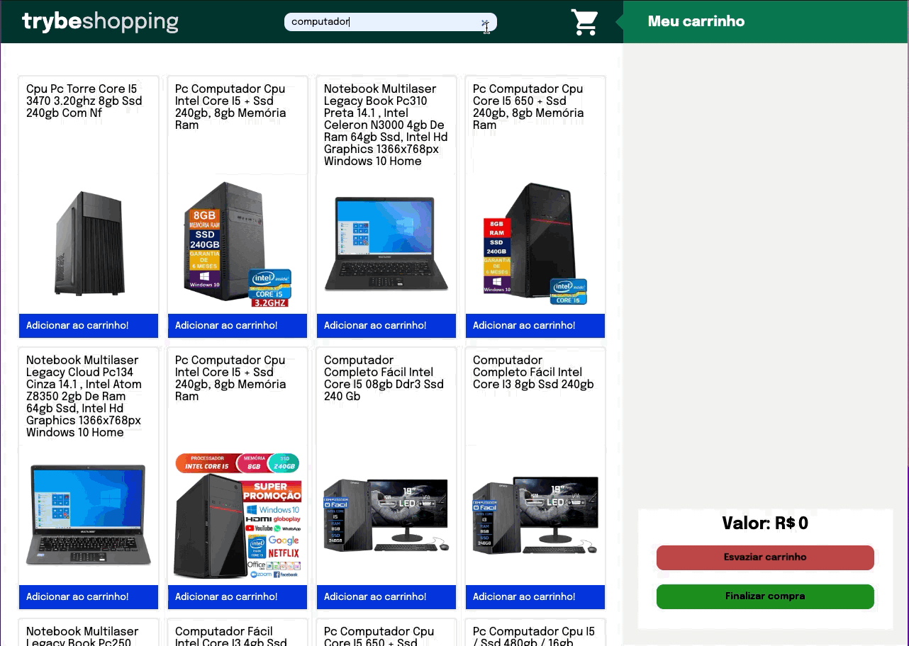

## Table of contents

- [Overview](#overview)
  - [The project](#the-project)
  - [Screenshot](#screenshot)
  - [Links](#links)
- [My process](#my-process)
  - [Built with](#built-with)
- [Author](#author)

## Overview

### The project

Develop a web page that fetches products information from Mercado Livre API. The page should count with a danamic shopping cart and search bar. 

Practiced skills:

- Fetch API and asynchronous Js;
- TDD (test driven development);
- Local Storage API;
- DOM manipulation and events;
- Css flexbox;
- Use React PropTypes to validade prop types;

### Screenshot

### Links

- Solution URL: [Github](https://github.com/RenatoDourad0/Project_Shopping_Cart_Trybe)
- [Live site](https://renatodourad0.github.io/Project_Shopping_Cart_Trybe/)

## My process

This project was a great opportunity to consolidate my knowledge of events and DOM manipulation in JS. Also a opportunity to go deeper in asynchronous JS and practice same Css positioning.

### Built with

- Vanilla JS
- CSS

## Author
  
  Renato Campos
- [GitHub](https://github.com/RenatoDourad0)
- [Linkedin](www.linkedin.com/in/renato-dourado-b1b301112)

Contributors besides Renato were responsible for evaluation files that have been removed after approval.
